## Lab 7: COBOL to Java — Policy Update Service Modernization

> **Prerequisites:** Complete Lab 1 (Lab Setup) before starting this lab.
> **Code Set:** `Sample Code/zOS Cobol/LGUPDB01.cbl`
> **Duration:** 30–45 minutes
> **Difficulty:** Intermediate

---

### Overview

In this lab, you'll analyze a production-style CICS/DB2 COBOL program and convert it into a modern Java 21 distributed service — replacing the CICS COMMAREA interface with a Spring Boot REST API, embedded SQL with Spring Data JPA, and downstream CICS LINK calls with an injected service interface.

---

### Learning Objectives

By the end of this lab, you will be able to:

- Use Bob to deeply analyze a CICS/DB2 insurance policy update program and surface all business rules
- Convert LGUPDB01 to a modern distributed Java 21 service with correct data type mapping
- Generate a JUnit 5 test suite that validates conversion accuracy for all three policy types
- Wrap the business logic in a Spring Boot REST API that replaces the CICS COMMAREA interface
- Explain the key COBOL → Java conversion patterns to a modernization audience

---

### Prerequisites

Before starting this lab, ensure the following are installed:

- **Java 21** (OpenJDK) — download from [IBM Semeru Runtimes](https://developer.ibm.com/languages/java/semeru-runtimes/downloads/)
- **Apache Maven 3.6+** — download from [maven.apache.org](https://maven.apache.org/download.cgi)

Verify before starting:

```bash
java -version   # should show OpenJDK 21.x.x
mvn -version    # should show Maven 3.6+
```

---

### Exercise: Analyze the COBOL Code

Before converting any legacy code, you need to fully understand its business logic, data structures, and non-obvious patterns.

#### Actions

ACTION: Ensure you are in **Z Code** mode

1. **Open the Source Program**
   - Open VS Code → **File → Open Folder** → select the workspace root
   - Open `Sample Code/zOS Cobol/LGUPDB01.cbl`

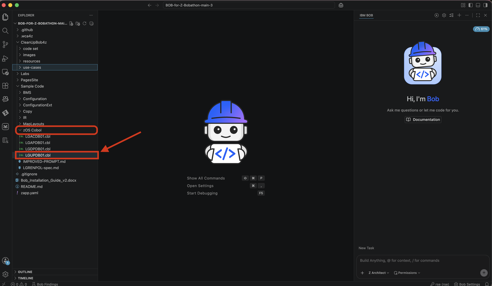

2. **Analyze LGUPDB01**
   - Enter the following prompt into the chat window:

   ```
   Analyze LGUPDB01.cbl and provide a comprehensive explanation of its functionality. Describe:

   1. The overall program structure and CICS execution flow (COMMAREA → DB2 → LINK)
   2. The optimistic locking strategy using LASTCHANGED timestamps
   3. The three policy-type update branches (Endowment, House, Motor) and what each updates
   4. The motor premium surcharge calculation based on accident count tiers
   5. The DB2 cursor pattern used (DECLARE / OPEN / FETCH / UPDATE WHERE CURRENT OF / CLOSE)
   6. Non-obvious COBOL patterns:
      - Host variable integer conversion (CA-* fields moved to DB2-*-INT before SQL)
      - INDICATOR variables for nullable DB2 columns (IND-BROKERID, IND-BROKERSREF, IND-PAYMENT)
      - VARCHAR handling for ENDOWMENT.PADDINGDATA using WS-VARY-FIELD
      - WS-COMMAREA-LENGTHS for minimum COMMAREA length validation
   7. Error handling: SQLCODE evaluation, EXEC CICS RETURN paths, WRITE-ERROR-MESSAGE

   Create a Mermaid sequence diagram showing:
   - CICS → LGUPDB01 → DB2 interaction
   - The optimistic lock check (timestamp comparison)
   - The three policy-type branches
   - The downstream EXEC CICS LINK to LGUPVS01
   ```

   - Click **arrow up** to start the analysis.

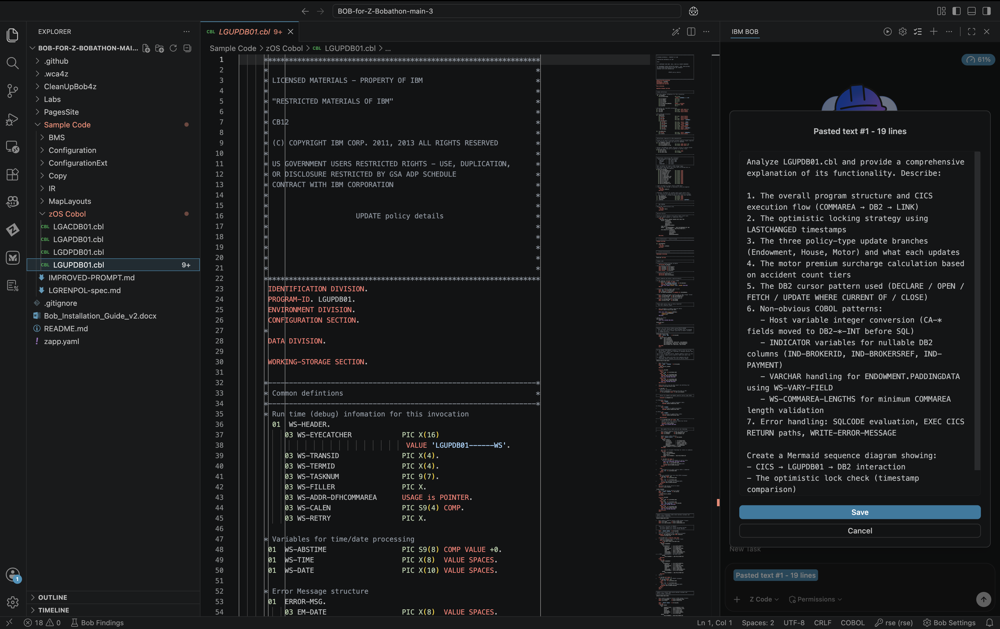

3. **Review the Analysis Results**
   Bob will surface all business rules, data structures, and non-obvious patterns in LGUPDB01, and generate a Mermaid sequence diagram. Please continue to approve any requests for skills or tools unless otherwise noted.

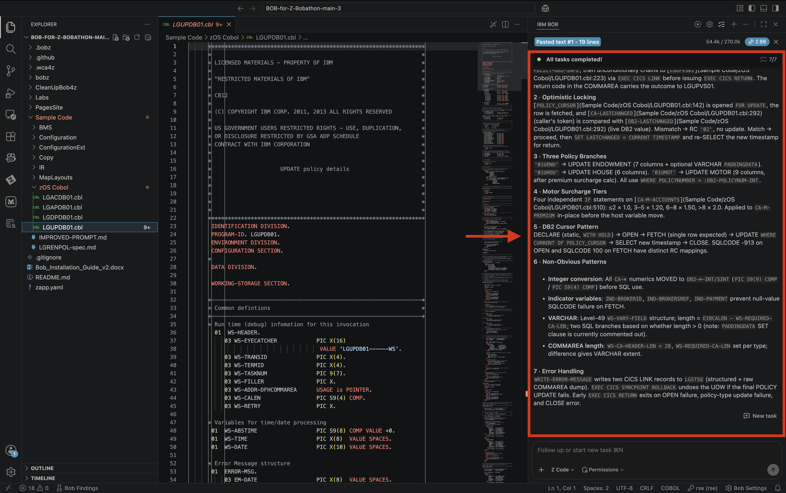

#### Expected Results

- ✅ COMMAREA-driven entry and optimistic locking strategy explained
- ✅ All three policy-type update branches (Endowment, House, Motor) documented
- ✅ Motor accident-tier premium surcharge calculation identified
- ✅ Host variable conversion, INDICATOR variables, and VARCHAR padding patterns surfaced
- ✅ Mermaid sequence diagram generated

---

### Exercise: Convert to Java 21

Generate the complete Java 21 port of LGUPDB01 as a distributed Spring Boot service.

#### Actions

ACTION: Ensure you are in **Z Code** mode

1. **Enter the conversion prompt**
   - Paste the following prompt into the chat window:

   ```
   Convert LGUPDB01.cbl to a Java 21 distributed service. Use Spring Boot 3 with Spring Data JPA and a DB2 dialect. Replace the CICS COMMAREA interface with a REST endpoint, and replace the EXEC CICS LINK to LGUPVS01 with an injected ValidationService interface. Use BigDecimal for all monetary fields, implement optimistic locking via @Version on the Policy entity, and map the three policy-type update branches to separate @Transactional service methods. Map COBOL return codes to HTTP status codes: "00" → 200, "01" → 404, "02" → 409, "90" → 500. Provide complete source for all classes, pom.xml, and application.properties.
   ```

   - Click **arrow up** to generate the service.

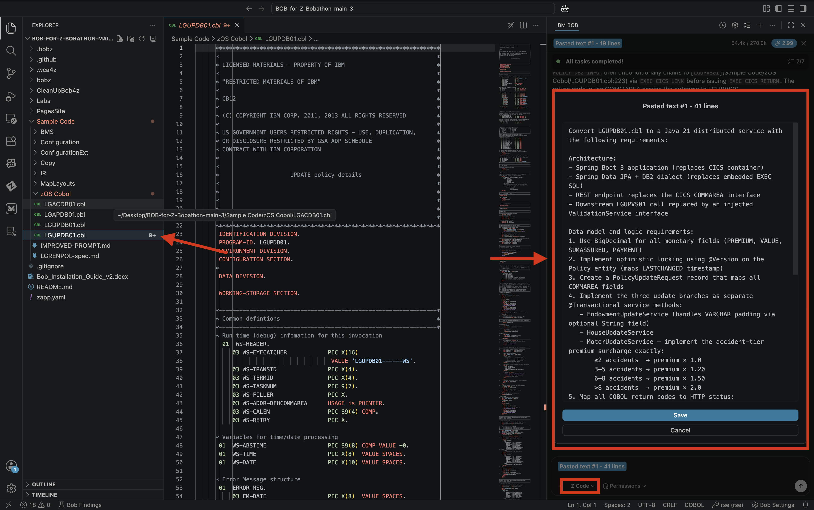

2. **Review the generated code**
   View the generated project structure on the left and explore the output in the chat window on the right.

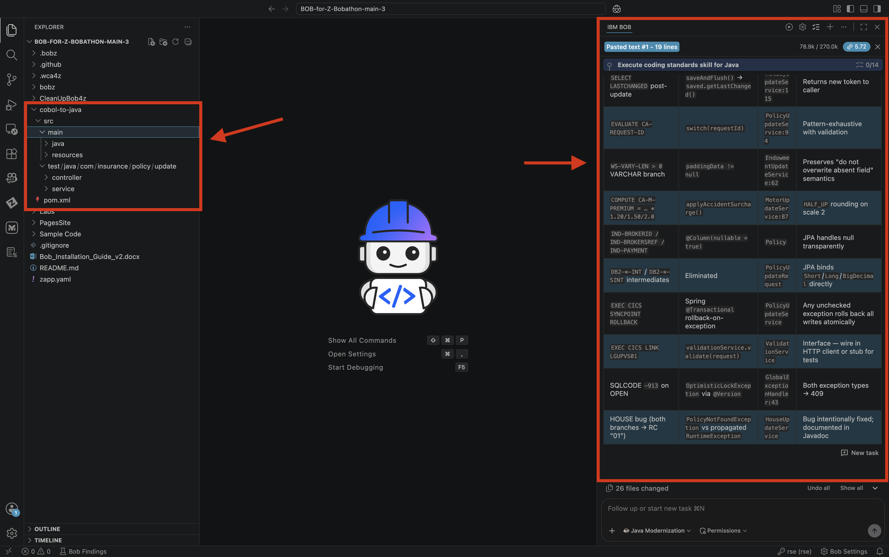

3. **Verify the build compiles**
   - Open a terminal and run:

   ```bash
   cd cobol-to-java
   mvn clean compile
   ```
> Tip: Your folder name may be different, adjust your commands accordingly.

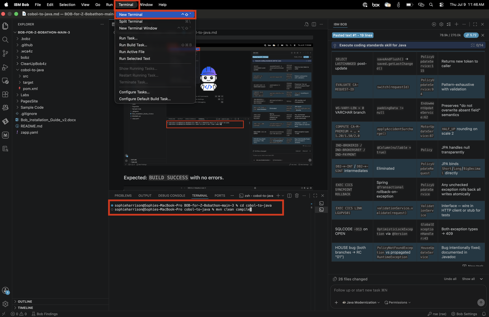

#### Expected Results

- ✅ Complete Maven project generated (controller, services, JPA entities, DTOs, exceptions)
- ✅ All COBOL return codes mapped to correct HTTP status codes
- ✅ Motor accident-tier premium surcharge logic preserved exactly
- ✅ `BUILD SUCCESS` with no compile errors

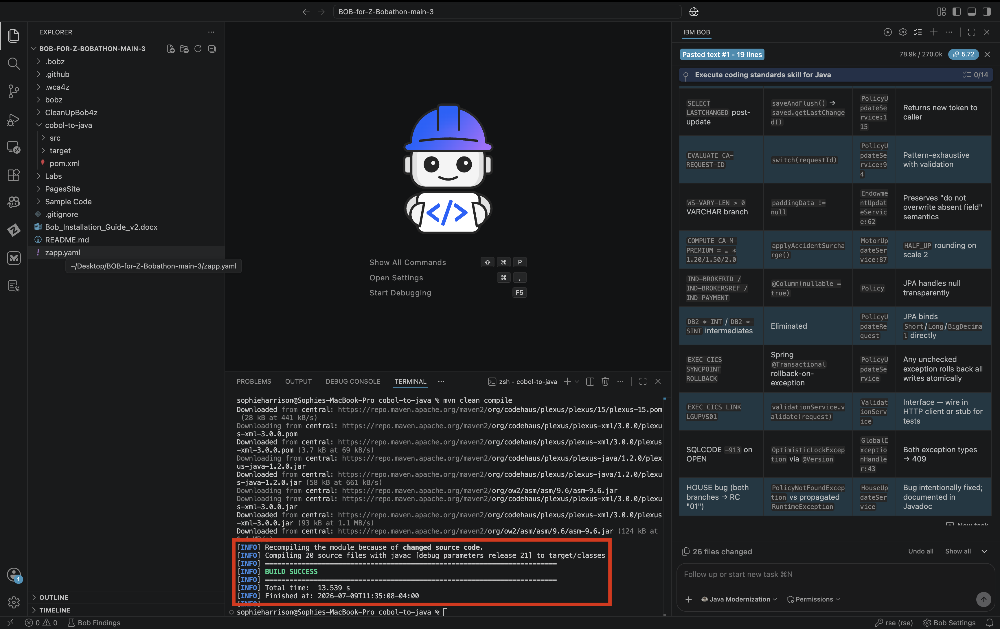

---

### Exercise: Create a Validation Test Suite

Generate a JUnit 5 test suite that proves all COBOL business rules are preserved in the Java service.

#### Actions

ACTION: Ensure you are in **Java Modernization** mode

1. **Enter the test generation prompt**
   - Paste the following prompt into the chat window:

   ```
   Create a comprehensive JUnit 5 test suite for the LGUPDB01 Java service. Include unit tests for all motor premium tiers (0, 2, 3, 5, 6, 8, 9, 100 accidents), unit tests for PolicyUpdateService covering all three policy-type routes plus the optimistic lock conflict and not-found paths, and MockMvc integration tests for the PUT /api/v1/policies/{policyNumber} endpoint. Also test the Endowment VARCHAR padding behaviour — with and without paddingData. Use Mockito for repository mocking and add @DisplayName annotations to all tests.
   ```

   - Click **arrow up** to generate the tests.

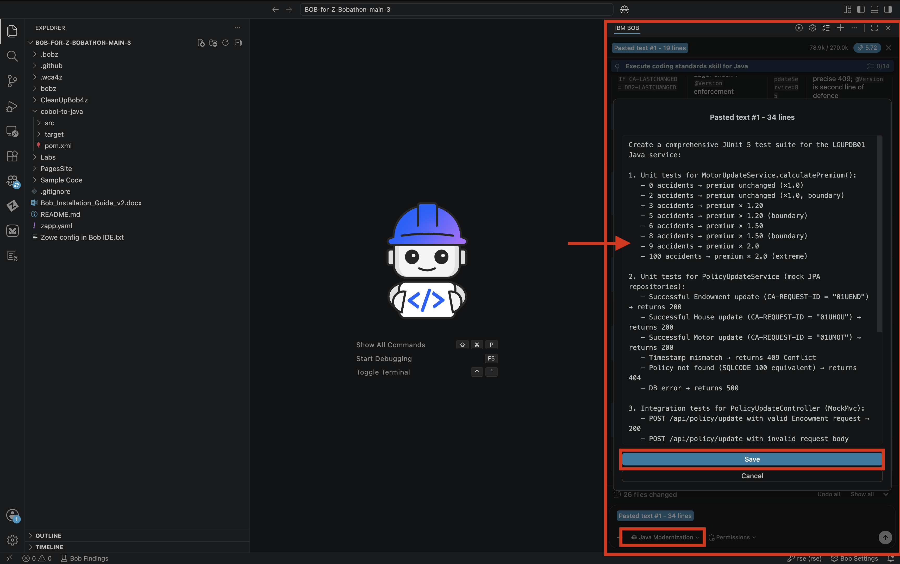

2. **Review the generated tests**
   Bob will produce test classes covering all business rule boundaries. Review them in the chat window.

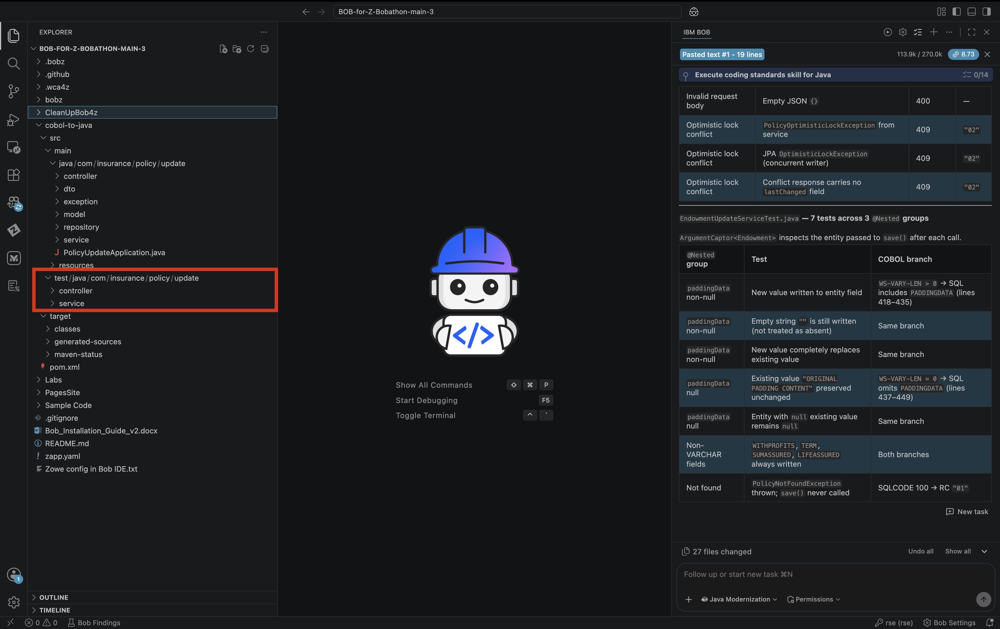

3. **Run the test suite**
   - Open a terminal and run:

   ```bash
   cd cobol-to-java
   mvn test
   ```
> Tip: Your folder name may be different, adjust your commands accordingly.

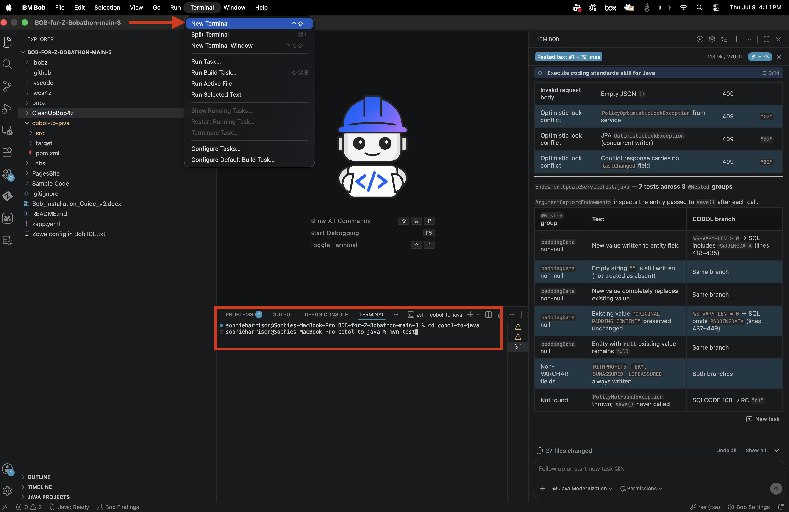

#### Expected Results

- ✅ All premium tier boundary tests pass (×1.0 / ×1.20 / ×1.50 / ×2.0)
- ✅ All three policy-type routing tests pass
- ✅ Optimistic lock conflict maps to HTTP 409
- ✅ Missing policy maps to HTTP 404
- ✅ `Tests run: 27, Failures: 0, Errors: 0` — `BUILD SUCCESS`

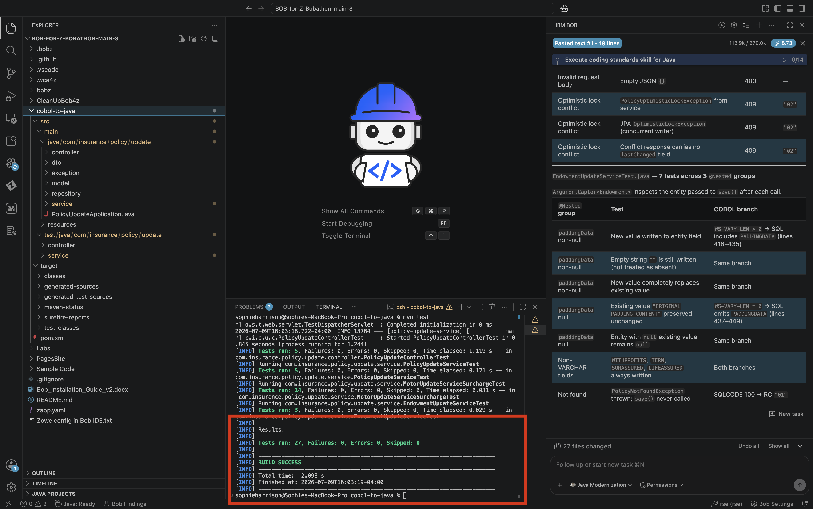

---

### Exercise: Add a REST API

Finalize the REST API with Swagger/OpenAPI documentation, input validation, and `curl` examples.

#### Actions

ACTION: Ensure you are in **Java Modernization** mode

1. **Enter the API finalization prompt**
   - Paste the following prompt into the chat window:

   ```
   Finalize the Spring Boot REST API for the LGUPDB01 policy update service. Add Bean Validation annotations (@NotNull, @Size, @Pattern) on PolicyUpdateRequest fields, Swagger/OpenAPI 3 annotations on the controller, CORS configuration for web clients, and a @ControllerAdvice GlobalExceptionHandler that maps all service exceptions to HTTP status codes. Provide updated application.properties, curl examples for all three policy types, and instructions to view the Swagger UI.
   ```

   - Click **arrow up** to generate.

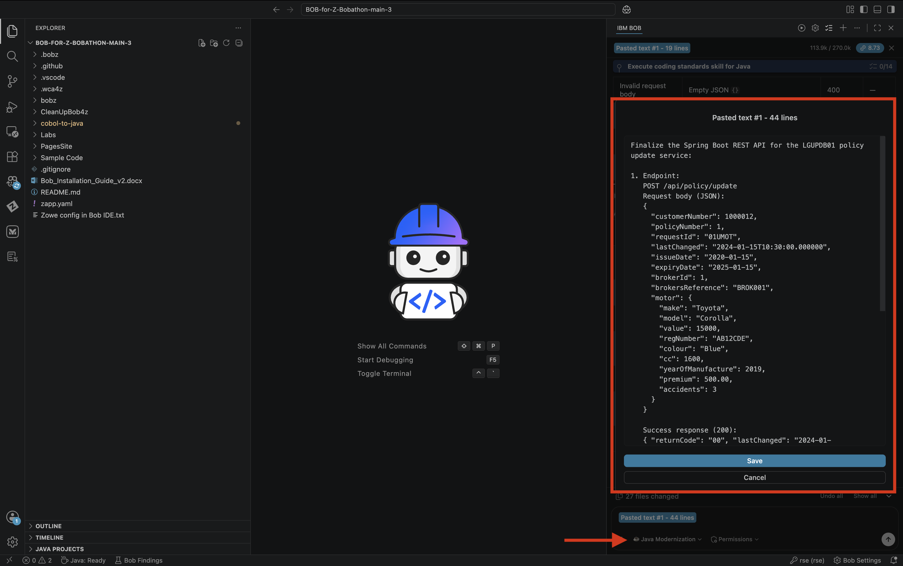

2. **Review the finalized controller and exception handler**

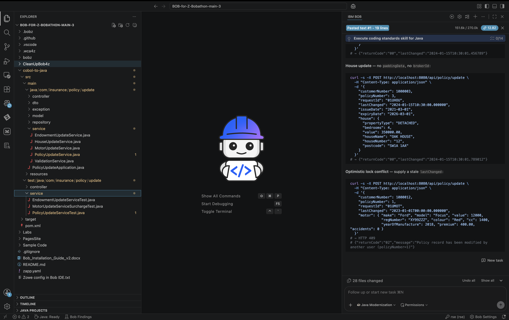

3. **Start the server and test the API**
   - Open a terminal and run:

   ```bash
   cd cobol-to-java
   mvn spring-boot:run
   ```
> Tip: Your folder name may be different, adjust your commands accordingly.

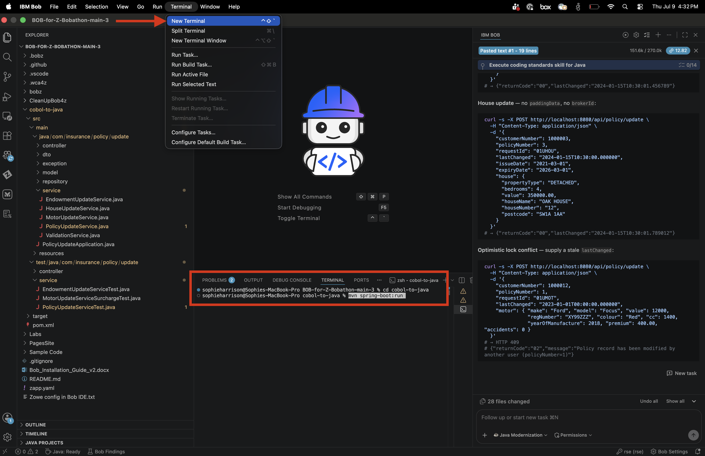

   - Once started, run the following `curl` to test the Motor update path:

   ```bash
   curl -s -X PUT http://localhost:8080/api/v1/policies/1 \
     -H "Content-Type: application/json" \
     -d '{
       "customerNumber": 1000012,
       "policyNumber": 1,
       "requestId": "01UMOT",
       "lastChanged": "2024-01-15T10:30:00",
       "issueDate": "2020-01-15",
       "expiryDate": "2025-01-15",
       "make": "Toyota",
       "model": "Corolla",
       "motorValue": 15000,
       "regNumber": "AB12CDE",
       "colour": "Blue",
       "engineCc": 1600,
       "yearOfManufacture": 2019,
       "premium": 500.00,
       "accidents": 3
     }'
   ```

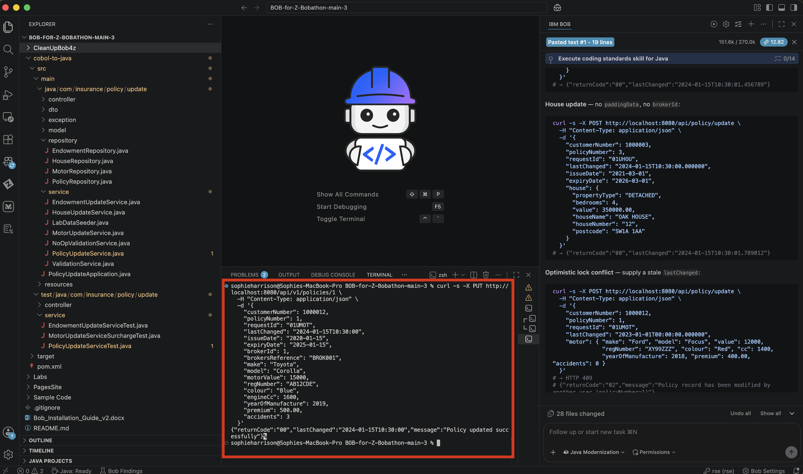

#### Expected Results

- ✅ `returnCode: "00"` — full success path exercised end-to-end
- ✅ Re-running the same `curl` returns HTTP 409 — optimistic lock demonstrated
- ✅ Invalid input returns HTTP 400 with field-level validation messages
- ✅ Swagger UI accessible at `http://localhost:8080/swagger-ui.html`

---

### Key Takeaways

- How to analyze a CICS/DB2 COBOL program and surface all business rules using Bob
- Converting COBOL data types and patterns to their Java equivalents
- Replacing CICS COMMAREA interfaces with REST endpoints
- Preserving optimistic locking semantics using JPA `@Version`
- Generating and running a full JUnit 5 test suite to validate conversion accuracy
