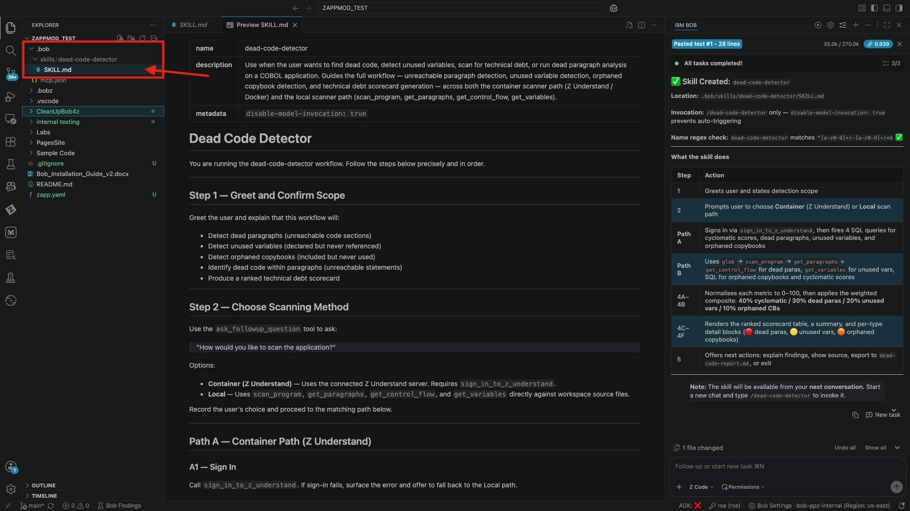
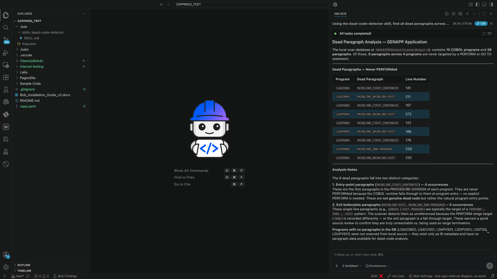
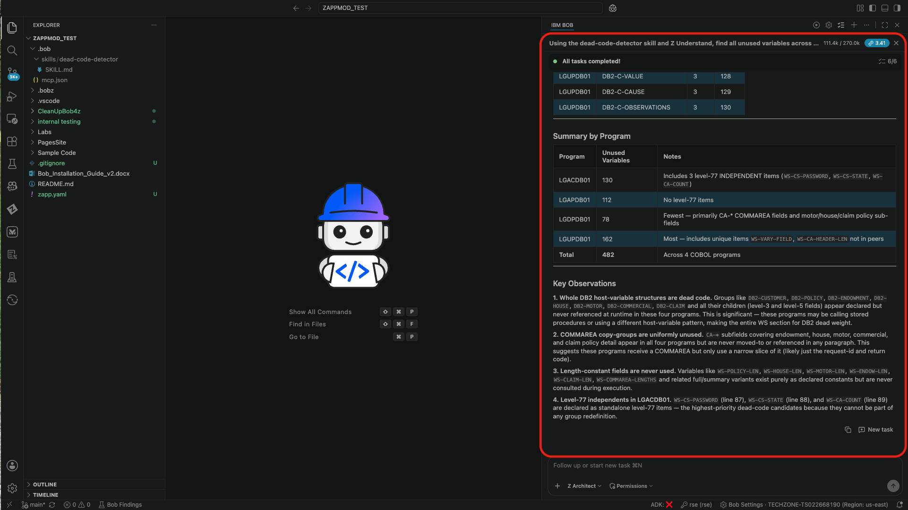
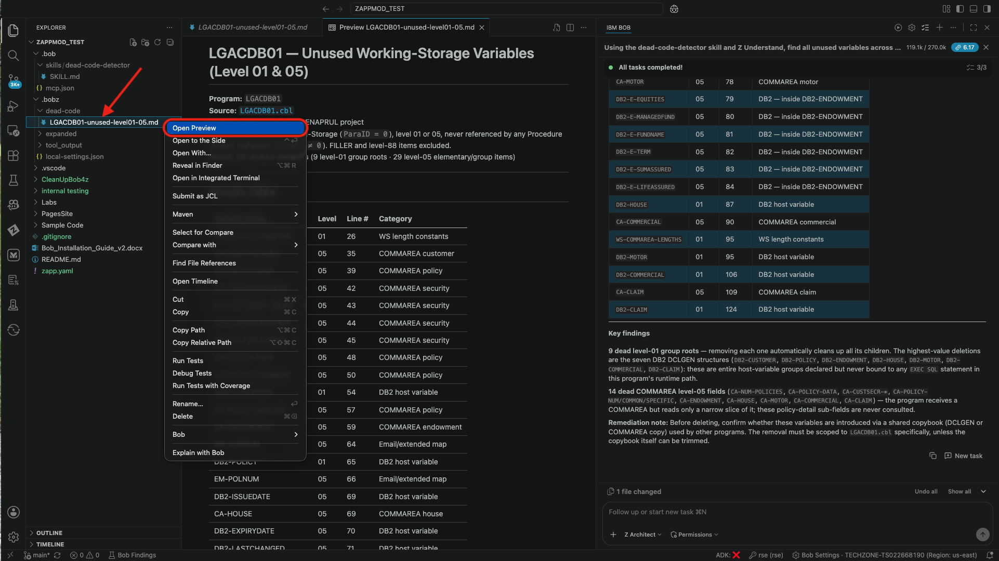
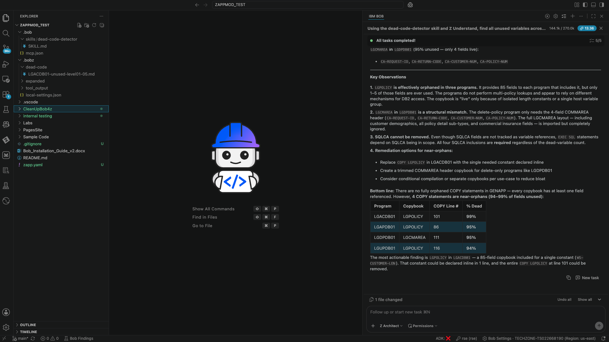
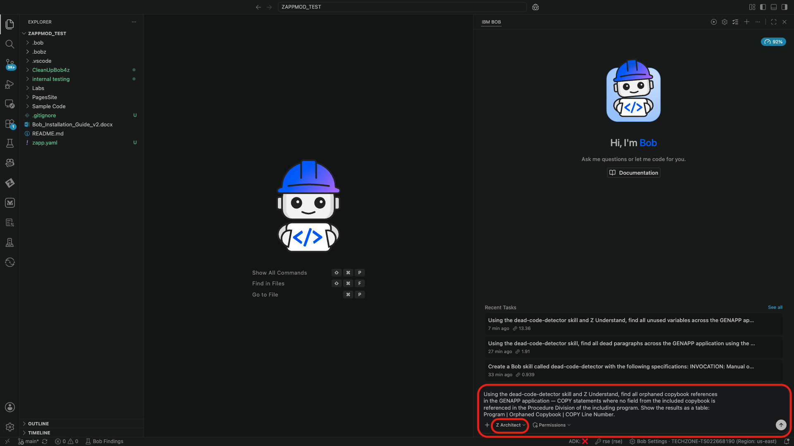
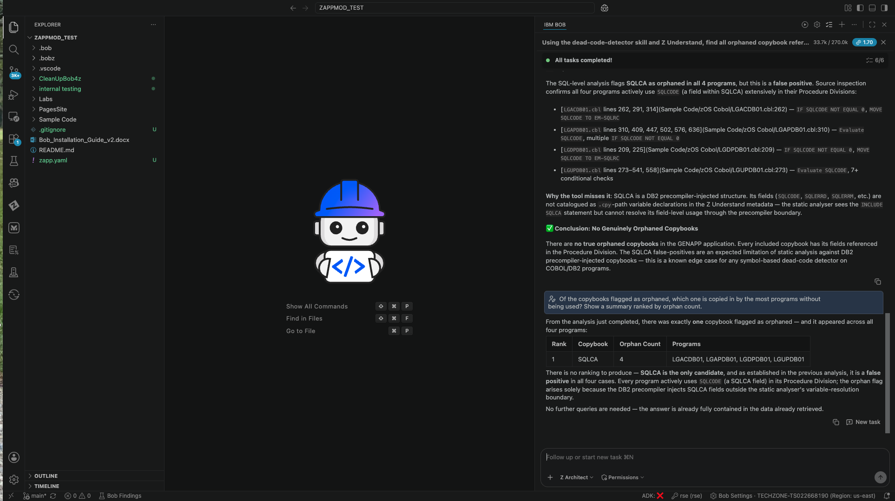
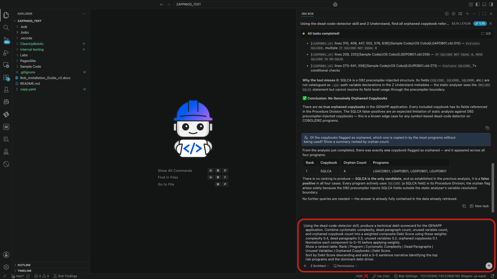
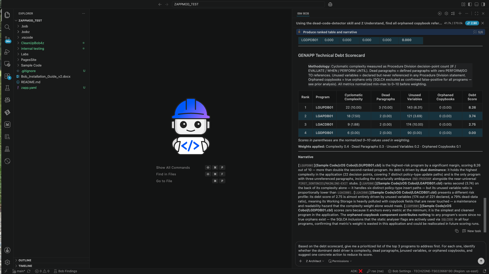
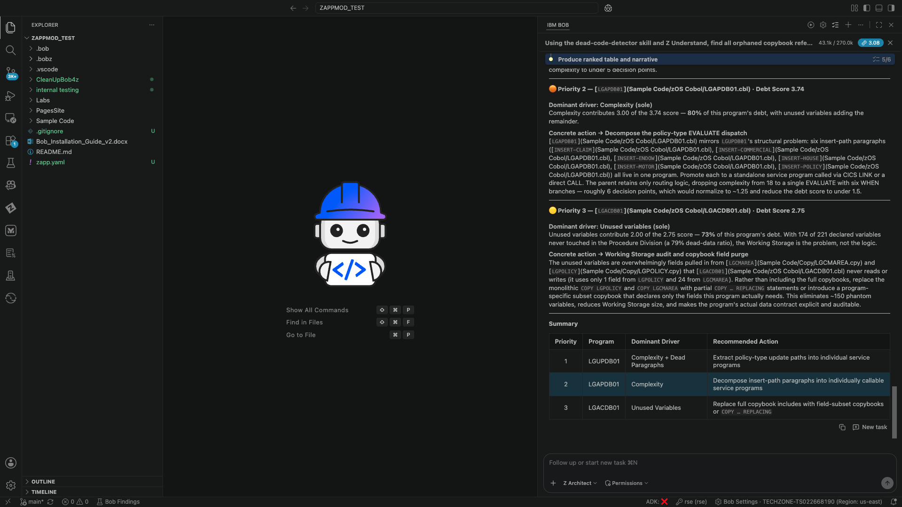

# Use Case: Dead Code & Technical Debt Detection

> **Prerequisites:** Complete `00-lab-setup.md` before starting this use case
> **Code Set:** Any COBOL workspace — recommended code: `Sample Code`
> **Modes:** Z Code (Exercise 1), Z Architect (Exercises 2–5)
> **Duration:** 60 minutes
> **Difficulty:** Intermediate

---

## Overview

Dead code and technical debt are silent maintenance liabilities in every long-lived COBOL application. Paragraphs that are never PERFORMed, variables that are declared but never used, and copybooks that are copied in but contribute nothing to execution — all of these accumulate over years of change, making programs harder to understand, test, and modernize. This lab teaches you to surface all three classes of dead code and combine the findings with cyclomatic complexity into a **technical debt scorecard** that ranks every program in your application by its maintenance risk.

The lab supports **two scanner paths** you can choose between based on your environment. The **container path** uses Z Understand deep analysis (requires Docker or Podman) for the highest-fidelity cross-program results. The **local path** uses Bob's built-in workspace scan tools — `scan_program`, `get_paragraphs`, `get_control_flow`, and `get_variables` — with no container required. Both paths produce the same scorecard output; the container path simply has deeper cross-program visibility.

---

## Learning Objectives

By the end of this use case, you will be able to:

- Identify unreachable (dead) paragraphs across a COBOL application
- Detect unused variables declared in Working-Storage but never referenced
- Find orphaned copybook includes where no field is used in the Procedure Division
- Produce a weighted technical debt scorecard ranking programs by composite risk
- Use the `dead-code-detector` custom skill to automate the full detection workflow
- Interpret scorecard results and prioritize which programs to address first

---

## Prerequisites

**Both paths:**
- Bob for Z workspace scan and Agent.md initialization completed (see `00-lab-setup.md`)
- Z Architect mode available

**Container path only (optional — higher fidelity):**
- Docker or Podman installed and running
- Z Understand connected to Bob in this workspace (use `sign_in_to_z_understand` in a new chat)

**Local path:**
- No additional prerequisites beyond `00-lab-setup.md`

---

## Setup: Choose Your Scanner Path

Before starting the exercises, decide which path you will use for this lab. You can change your mind between sessions — the skill supports both.

> **Tip:** The local path is fully capable of producing a meaningful scorecard for most workspaces. Use the container path only if you need cross-program dead paragraph analysis at scale (e.g., 20+ programs).

Both paths are shown side-by-side in each exercise below. Follow the section that matches your setup.

---

## Exercise 1: Install the `dead-code-detector` Skill (10 minutes)

### What You'll Learn

Use the Bob Skill Builder to install the `dead-code-detector` custom skill into your workspace. Once installed, the skill auto-activates whenever you use trigger phrases like "find dead code", "scan for technical debt", or "dead paragraph analysis" — loading specialized detection instructions into Bob's context automatically.

### Bob Mode to Use

**🧰 Z Code**

Switch to Z Code mode using the mode selector at the bottom of the chat window.

### Instructions

1. **Copy and paste this prompt into a new Z Code chat to request skill installation:**

   ```
   Create a Bob skill called dead-code-detector with the following specifications:

   INVOCATION: Manual only via /dead-code-detector (no auto-activation)

   DUAL PATHS:
   • Container: Z Understand (sign_in_to_z_understand)
   • Local: scan_program + get_paragraphs + get_control_flow + get_variables

   DETECTION SCOPE (all four types):
   • Dead paragraphs (unreachable code sections)
   • Unused variables (declared but never referenced)
   • Orphaned copybooks (included but not used)
   • Dead code within paragraphs (unreachable statements)

   WORKFLOW:
   • User invokes /dead-code-detector
   • Prompt for scanning method (container or local)
   • Execute selected path
   • Analyze all dead code types
   • Generate technical debt scorecard

   SCORECARD OUTPUT:
   Rank programs by weighted composite:
   • Cyclomatic complexity (40% weight)
   • Dead paragraph count (30% weight)
   • Unused variable count (20% weight)
   • Orphaned copybook count (10% weight)
   Display ranked by highest debt score (most critical first)
   ```

2. Bob scaffolds the skill at `.bob/skills/dead-code-detector/SKILL.md`. Approve tool requests as they appear.

3. When complete, open the file at `.bob/skills/dead-code-detector/SKILL.md` and verify the frontmatter.



### Expected Results

- ✅ `.bob/skills/dead-code-detector/SKILL.md` created
- ✅ Frontmatter contains `name: dead-code-detector`
- ✅ Description includes trigger phrases: "find dead code", "detect unused variables", "scan for technical debt", "dead paragraph analysis"
- ✅ Skill body covers both the container path and the local path
- ✅ Skill body includes all four detection types: dead paragraphs, unused variables, orphaned copybooks, scorecard

> **Note:** The skill will be available in your **next chat session** — start a new chat after this exercise to activate it. Click the **+** button at the top of the chat panel.

---

## Exercise 2: Dead Paragraph Detection (15 minutes)

### What You'll Learn

Dead paragraphs are paragraphs that are declared in a COBOL program but never PERFORMed — they are unreachable during normal execution. They accumulate when logic is commented out, superseded by rewrites, or simply forgotten. Identifying them is the first step toward reducing program complexity.

### Bob Mode to Use

**📐 Z Architect**

Start a **new chat** in Z Architect mode. The `dead-code-detector` skill will auto-activate when you use the trigger phrases below.

### Instructions

> Choose the prompt block that matches your scanner path.

**Container path:**

```
Using the dead-code-detector skill and Z Understand analysis, find all dead paragraphs
across the GENAPP application — paragraphs that are never PERFORMed by any other paragraph.
Show the results as a table: Program | Dead Paragraph | Line Number.
```

**Local path:**

```
Using the dead-code-detector skill, find all dead paragraphs across the GENAPP application
using the local scanner path. Use scan_program, get_paragraphs, and get_control_flow to
identify paragraphs that are never PERFORMed. Show the results as a table:
Program | Dead Paragraph | Line Number.
```

Approve any tool requests that appear — Bob will scan each program and build the control flow graph before reporting findings.



**Drill down on a specific program:**

```
Show me the full control flow graph for LGAPDB01 and highlight any paragraphs that have no
inbound PERFORM edges.
```



**Note:** Your chat window may look different from mine depending on if you are using the local or container scan. Or if you are using your own code.

### Expected Results

- ✅ Dead paragraph table produced for all GENAPP programs (LGACDB01, LGAPDB01, LGDPDB01, LGUPDB01)
- ✅ Each row shows: program name, dead paragraph name, and line number
- ✅ Programs with no dead paragraphs appear with "None" in the Dead Paragraph column
- ✅ Control flow graph for LGAPDB01 shows which paragraphs are reachable vs. unreachable

---

## Exercise 3: Unused Variable Detection (10 minutes)

### What You'll Learn

Working-Storage variables that are declared but never referenced in the Procedure Division add noise to every program that includes them. They inflate copybooks, confuse readers, and occasionally mask bugs when a variable name collision silently shadows an active field. This exercise surfaces all such variables across the application.

### Bob Mode to Use

**📐 Z Architect**

Continue in the same chat from Exercise 2, or start a new one.

### Instructions

> Choose the prompt block that matches your scanner path.

**Container path:**

```
Using the dead-code-detector skill and Z Understand, find all unused variables across
the GENAPP application — data items declared in Working-Storage that are never referenced
in the Procedure Division. Show the results as a table:
Program | Unused Variable | Level | Line Number.
Exclude FILLER items and level-88 condition names.
```

**Local path:**

```
Using the dead-code-detector skill, find all unused variables across the GENAPP application
using the local scanner path. Use get_variables to enumerate declared data items, then check
each one for references in the Procedure Division. Show the results as a table:
Program | Unused Variable | Level | Line Number.
Exclude FILLER items and level-88 condition names.
```



**Dig into a specific program:**

```
For LGACDB01, show me every Working-Storage variable at level 01 or 05 that is declared
but never read or written in the Procedure Division.
```



### Expected Results

- ✅ Unused variable table produced across all GENAPP programs
- ✅ FILLER and level-88 condition names excluded from results
- ✅ Each row shows: program name, variable name, level number, and declaration line
- ✅ Programs with no unused variables appear with "None" in the Unused Variable column

---

## Exercise 4: Orphaned Copybook Detection (10 minutes)

### What You'll Learn

A copybook is orphaned when it is included via a COPY statement but none of its fields are ever referenced in the Procedure Division of the including program. This often happens when a copybook is added speculatively "for future use", or when the logic that consumed its fields is later removed without removing the COPY statement. Orphaned copybooks inflate program size and create unnecessary compile-time dependencies.

### Bob Mode to Use

**📐 Z Architect**

Continue in the same chat, or start a new one.

### Instructions

> Choose the prompt block that matches your scanner path.

**Container path:**

```
Using the dead-code-detector skill and Z Understand, find all orphaned copybook references
in the GENAPP application — COPY statements where no field from the included copybook is
referenced in the Procedure Division of the including program. Show the results as a table:
Program | Orphaned Copybook | COPY Line Number.
```

**Local path:**

```
Using the dead-code-detector skill, find all orphaned copybook references in the GENAPP
application using the local scanner path. For each COPY statement, check whether any field
from that copybook is referenced in the Procedure Division. Show the results as a table:
Program | Orphaned Copybook | COPY Line Number.
```



**Cross-reference with the most-included copybook:**

```
Of the copybooks flagged as orphaned, which one is copied in by the most programs without
being used? Show a summary ranked by orphan count.
```



### Expected Results

- ✅ Orphaned copybook table produced for all GENAPP programs
- ✅ Each row shows: program name, copybook name, and COPY statement line number
- ✅ Programs with no orphaned copybooks appear with "None"
- ✅ Summary shows which copybooks are most frequently orphaned across the application

---

## Exercise 5: Technical Debt Scorecard (15 minutes)

### What You'll Learn

The debt scorecard combines all three dead code dimensions with cyclomatic complexity into a single weighted composite score per program. This gives you an objective, data-driven ranking of which programs carry the most maintenance risk — and should be prioritized for cleanup, refactoring, or modernization.

**Debt Score formula:**

```
Debt Score = (cyclomatic_complexity × 0.4)
           + (dead_paragraph_count  × 0.3)
           + (unused_variable_count × 0.2)
           + (orphaned_copybook_count × 0.1)
```

Each component is normalized to 0–10 relative to the highest value observed across all programs before the weights are applied, so the final Debt Score is always in the range 0–10.

### Bob Mode to Use

**📐 Z Architect**

Continue in the same chat, or start a new one.

### Instructions

1. **Request the scorecard:**

   ```
   Using the dead-code-detector skill, produce a technical debt scorecard for the GENAPP
   application. Combine cyclomatic complexity, dead paragraph count, unused variable count,
   and orphaned copybook count into a weighted composite Debt Score using these weights:
   complexity 0.4, dead paragraphs 0.3, unused variables 0.2, orphaned copybooks 0.1.
   Normalize each component to 0–10 before applying weights.
   Show a ranked table: Rank | Program | Cyclomatic Complexity | Dead Paragraphs |
   Unused Variables | Orphaned Copybooks | Debt Score.
   Sort by Debt Score descending and add a 3–5 sentence narrative identifying the top
   risk programs and the dominant debt driver.
   ```

2. Approve tool requests — Bob may re-scan programs to gather fresh complexity data if the chat context does not already contain it.



3. **Ask for prioritized remediation recommendations:**

   ```
   Based on the debt scorecard, give me a prioritized list of the top 3 programs to address
   first. For each one, identify whether the dominant debt driver is complexity, dead paragraphs,
   unused variables, or orphaned copybooks, and suggest one concrete action to reduce its score.
   ```



### Expected Results

- ✅ Scorecard table contains all GENAPP programs ranked by Debt Score (highest first)
- ✅ All four metric columns are populated: Cyclomatic Complexity, Dead Paragraphs, Unused Variables, Orphaned Copybooks
- ✅ Debt Score values are in the range 0–10
- ✅ Narrative paragraph follows the table identifying top-risk programs and the dominant debt driver
- ✅ Remediation recommendations identify one concrete action per top-3 program



---

## Key Takeaways

- **Dead code compounds** — dead paragraphs, unused variables, and orphaned copybooks each add a small burden; combined they make programs materially harder to maintain and modernize
- **The local path is sufficient** for most workspaces — `scan_program`, `get_paragraphs`, `get_control_flow`, and `get_variables` give Bob everything it needs to produce a meaningful scorecard without a container
- **The container path (Z Understand) pays off at scale** — for applications with 20+ programs or deep cross-program PERFORM chains, Z Understand's deeper index resolves ambiguous cases the local tools cannot
- **The Debt Score is a triage tool**, not a verdict — use it to identify where to look first, not to make architectural decisions without further investigation
- **The skill is a reusable team asset** — once installed in `.bob/skills/`, every developer in the workspace gets the same detection workflow automatically without needing to know the individual tool calls

---

## Troubleshooting

**Skill does not auto-activate when I type a trigger phrase**
- Confirm the skill file exists at `.bob/skills/dead-code-detector/SKILL.md`
- Start a fresh chat — skills only activate in sessions started after the skill file was created
- Check that your prompt contains one of the exact trigger phrases: "find dead code", "detect unused variables", "scan for technical debt", or "dead paragraph analysis"

**Container path: Z Understand shows no results**
- Confirm Docker or Podman is running (`docker ps` or `podman ps` in a terminal)
- Re-run `sign_in_to_z_understand` in a fresh Z Architect chat to re-establish the connection
- Verify the workspace was indexed after the last code change — ask Bob: "Is the Z Understand index current for this workspace?"

**Local path: `get_paragraphs` returns an empty list**
- The workspace scan may not be current — ask Bob: "Scan all programs in this workspace using scan_program"
- Confirm you are in **Z Architect** mode, not Ask or Z Code mode — the scan tools are only available in Z Architect

**Local path: dead paragraph count seems too high**
- Some programs use a PERFORM … THRU pattern that is not visible as individual PERFORM edges — ask Bob to account for PERFORM … THRU ranges when building the control flow graph
- Entry-point paragraphs (MAINLINE, 0000-MAIN, etc.) are intentionally excluded from dead paragraph counts — if a paragraph is being incorrectly flagged, ask Bob to verify whether it is the program entry point

**Scorecard Debt Score is 0 for all programs**
- This means all four raw metric values were 0 across all programs — either the workspace scan did not find any dead code (valid result) or the scan was incomplete
- Ask Bob: "Confirm that get_paragraphs, get_control_flow, and get_variables returned data for at least one program before computing the scorecard"

**Unused variables list is very long**
- In older COBOL codebases it is common to find many declared-but-unused fields, especially in programs that share large copybooks
- Use the drill-down prompt (Exercise 3) to focus on level-01 and level-05 variables first, as these represent the most significant bloat

---

**Dead Code & Technical Debt Detection Complete!** 🎉

You now have a custom `dead-code-detector` skill and a repeatable, scanner-agnostic workflow for surfacing dead code and ranking programs by technical debt — a foundation for every future cleanup, refactoring, or modernization effort.
