# Use Case: Application Discovery & Understanding

> **Prerequisites:** Complete `00-lab-setup.md` before starting this use case
> **Code Set:** Any COBOL workspace — recommended code: `Sample Code`
> **Duration:** 30 minutes
> **Difficulty:** Beginner

---

## Overview

In this use case, you will use Bob to explore and understand the GENAPP application — its program relationships, data flow, internal logic, and overall structure. Rather than following a fixed sequence, you will work through a set of guided prompts organized by topic. Each section introduces a different lens for understanding the codebase. Use these prompts as a starting point and write your own variations to dig deeper into areas that interest you.

---

## Learning Objectives

By the end of this use case, you will be able to:

- Navigate the GENAPP application using Bob's analysis capabilities
- Generate call graphs, flow diagrams, and dependency trees
- Explore variable data flow and understand how data moves between programs
- Use Bob to identify complexity hotspots across the codebase
- Formulate your own prompts to investigate areas of interest

---

## Actions

1. Ensure you have completed the workspace scan and Agent.md initialization from `00-lab-setup.md`
2. Ensure you are in **Z Architect** mode for all exercises in this use case
3. Copy the prompt from the code block and paste it directly into the Bob chat
4. Approve any tool requests that appear — or enable **Auto Approve** in the **Permissions** dropdown for longer-running prompts
5. Review the output, then continue to the next exercise or try a variation of your own

> **Tip:** Start a fresh chat between unrelated exercises to avoid context from one analysis carrying into the next. Click the **+** button at the top of the chat panel to open a new chat.

---

## Exercises

### Exercise: Call Graphs

Call graphs show which programs invoke which other programs across the entire application. They are useful for understanding the overall structure of the codebase, identifying entry points, and tracing execution paths from a starting program all the way down to its deepest dependencies.

> Ensure you are in **Z Architect** mode for all prompts in this section.

**1. Full application call graph**

```
Generate a call graph for the entire GENAPP application showing which programs call which other programs.
```

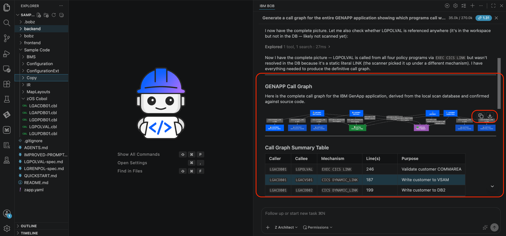

**2. Call chain from a specific program**

```
Show me the full call chain starting from LGACDB01 down to every program it directly or transitively calls.
```

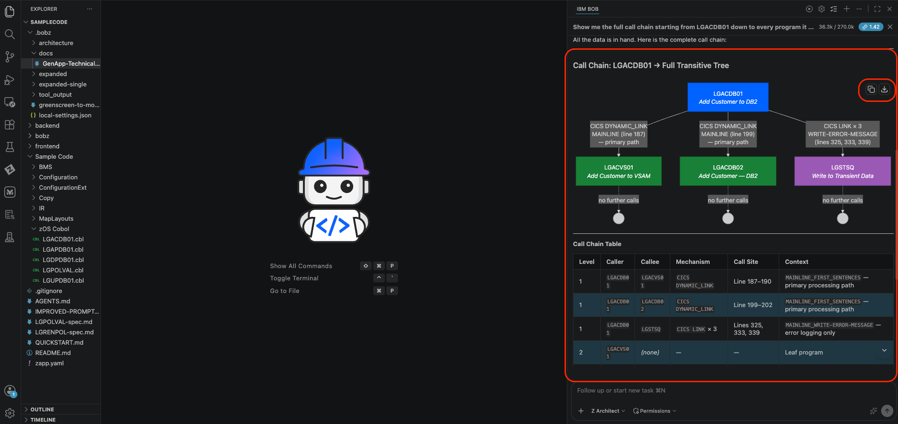

**3. Entry point discovery**

```
Which programs in the codebase are never called by any other program? Show them as entry points.
```

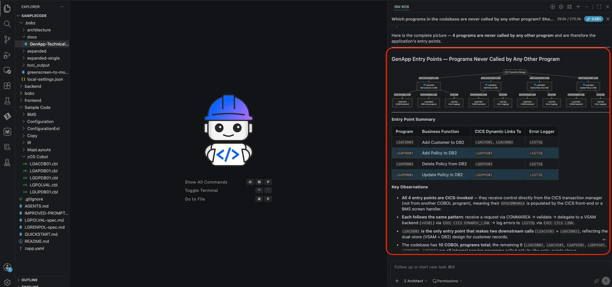

**4. Scoped call graph — customer operations**

```
Draw a call graph for the adding a customer only —  and their callees.
```

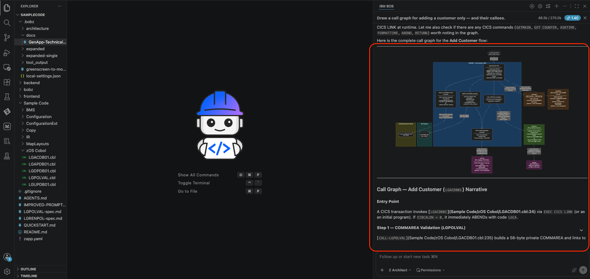

**5. Reverse call graph**

```
Which programs call LGSTSQ? Show me the reverse call graph for the error logging utility.
```

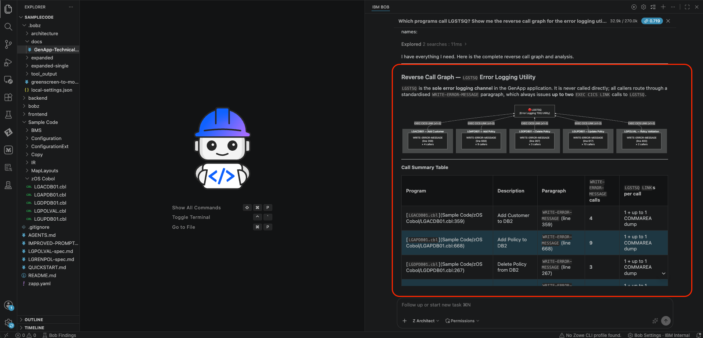

---

### Exercise: DB2 Access Graphs

DB2 access graphs map which programs read from or write to which database tables. They help you understand the data access layer of the application — which programs own which tables, where inserts and updates happen, and which programs would be at risk from a schema change.

> Ensure you are in **Z Architect** mode for all prompts in this section.

**1. Table insert graph**

```
Draw a SQL access graph for LGAPDB01 showing all tables it inserts into.
```

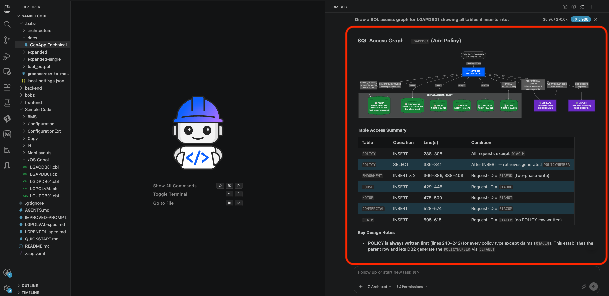

**2. Schema change impact**

```
I am researching what programs would be impacted if the policy table schema was changed. Can you show me a graph that represents this?
```

> **Tip:** Bob may ask clarifying questions before generating the graph. Select from the options presented or type your own clarification to guide the output.

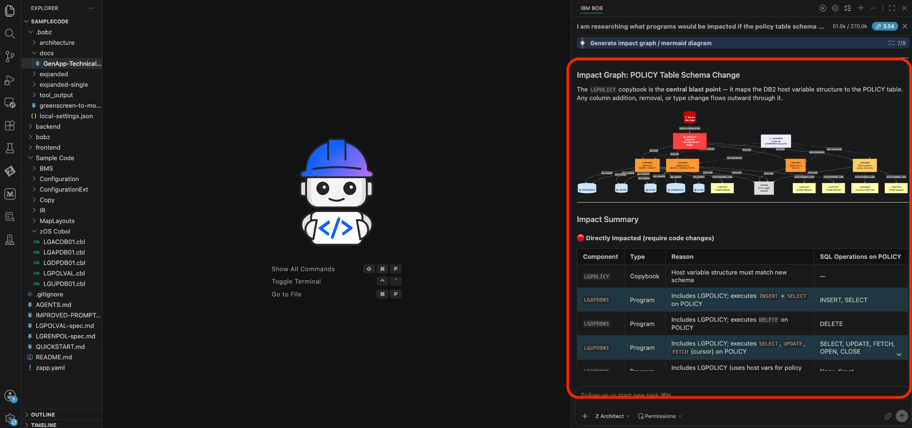

---

### Exercise: Impact Analysis

Impact analysis traces the downstream effects of a proposed change — whether to a copybook field, a data structure, or a shared variable. It answers the question "if I change this, what else breaks?" before you touch a single line of code.

> Ensure you are in **Z Architect** mode for all prompts in this section.

**1. Copybook change impact**

```
Show me all programs that would be affected if I change lgpolicy.cpy.
```

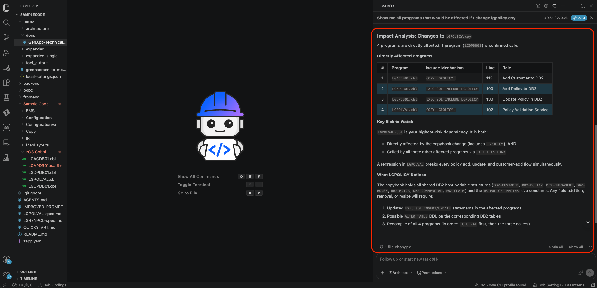

**2. Most-included copybook**

```
Which copybook is included by the most programs? Draw a dependency graph ranked by inclusion count.
```

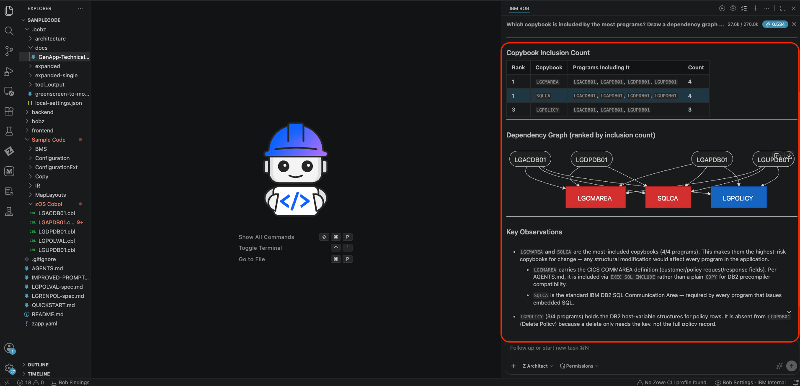

**3. Full include tree**

```
Draw the full include tree for LGAPDB01 showing every copybook it depends on.
```

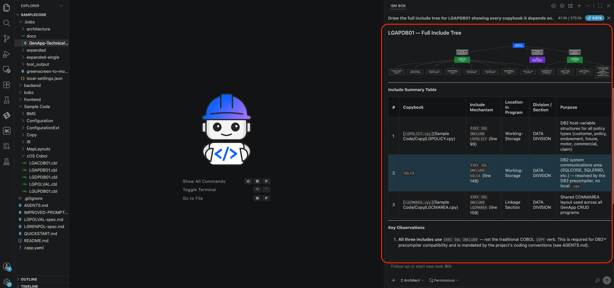

---

### Exercise: Flow Charts

Paragraph flow diagrams visualize the internal control flow of a COBOL program — which paragraphs PERFORM which other paragraphs and in what order. They are the equivalent of a function call graph but scoped to a single program, making it easier to understand program logic without reading every line of code.

> Ensure you are in **Z Architect** mode for all prompts in this section.

**1. Internal control flow graph**

```
Draw the internal control flow graph for LGAPDB01 showing which paragraphs PERFORM which other paragraphs.
```

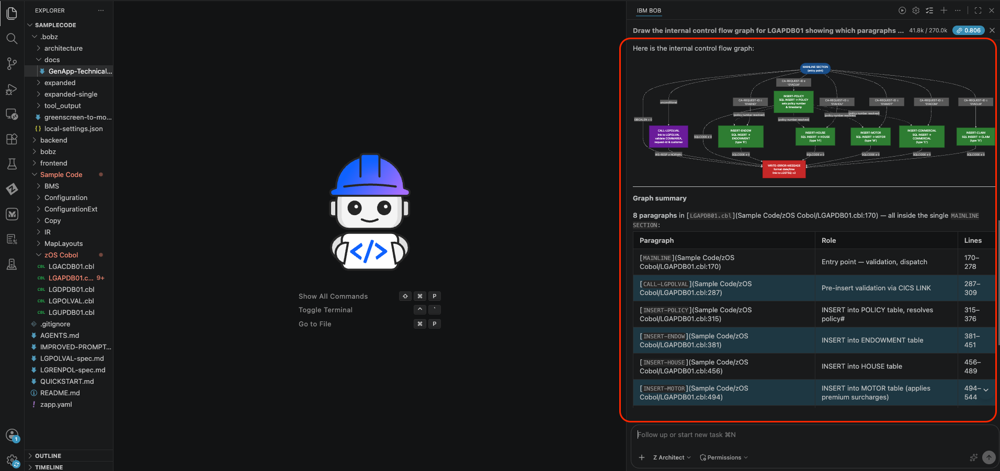

**2. Paragraph flow from MAINLINE**

```
Show me the paragraph flow for LGUPDB01 — which paragraphs does MAINLINE call?
```

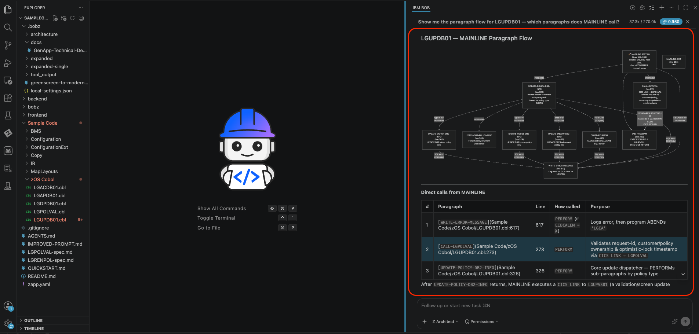

**3. Dead paragraph detection**

```
Which paragraphs in LGTESTC1 are never PERFORMed by any other paragraph? Identify dead paragraphs.
```

> **Note:** Image coming soon.

**4. Execution order diagram**

```
Generate a paragraph flow diagram for LGACDB01 showing the order of execution from MAINLINE.
```

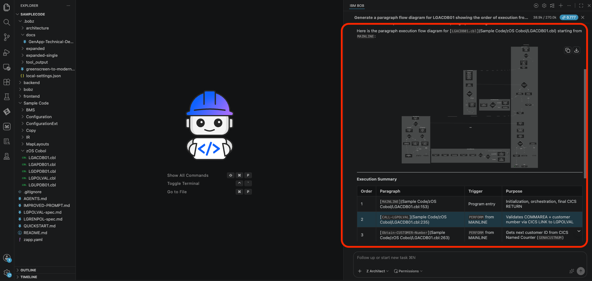

**5. Most-called paragraph**

```
Which paragraph in LGAPDB01 is called from the most places? Show its callers as a graph.
```

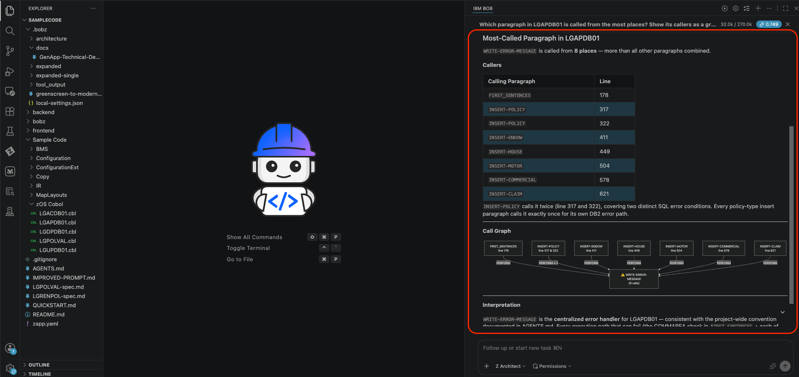

---

### Exercise: Complexity Report

Cyclomatic complexity measures the number of independent paths through a program — the higher the score, the harder the program is to test and maintain. A complexity heatmap across the whole application quickly surfaces the programs most likely to contain bugs, resist change, or require the most attention during modernization.

> Ensure you are in **Z Architect** mode for all prompts in this section.

**1. Application-wide complexity heatmap**

```
Rank all GENAPP programs by cyclomatic complexity and show a heatmap of the top 10 most complex.
```

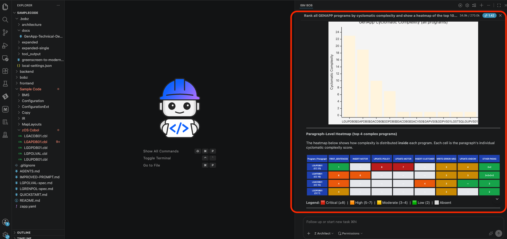

---

### Exercise: Variable Usage

Variable data flow analysis traces how a specific field moves through the application — where it is assigned, where it is read, and which paragraphs or programs it passes through. This is especially useful for understanding COMMAREA fields and shared data structures that span multiple programs.

> Ensure you are in **Z Architect** mode for all prompts in this section.

**1. Cross-program data flow**

```
Trace the data flow of CA-CUSTOMER-NUM across all programs — where is it written and where is it read?
```

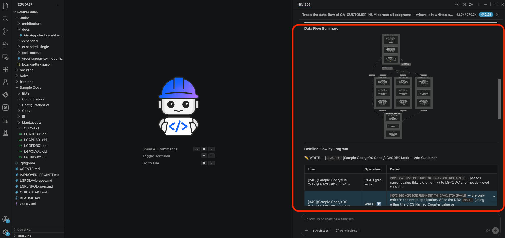

**2. Variable flow within a program**

```
Show me a variable data flow graph for DB2-CUSTOMERNUM-INT inside LGACDB01.
```

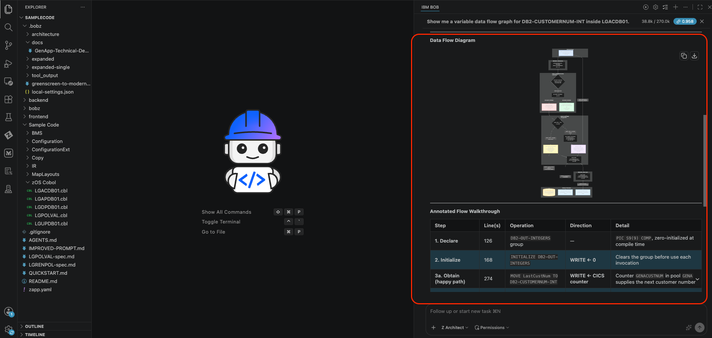

**3. Inter-paragraph data flow**

```
Which variables in LGAPDB01 are written in one paragraph and read in another? Show the data flow between paragraphs.
```

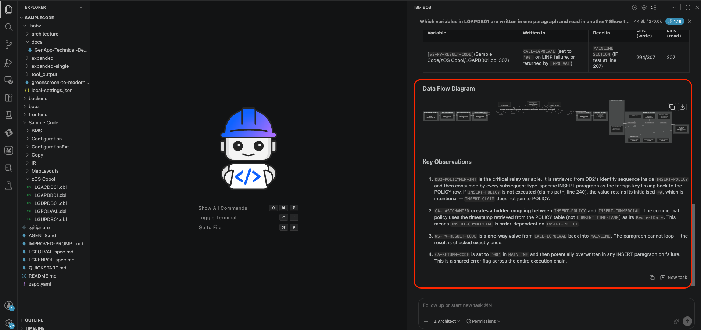

**4. Return code trace**

```
Trace CA-RETURN-CODE across the entire application — which programs set it and which programs check it?
```

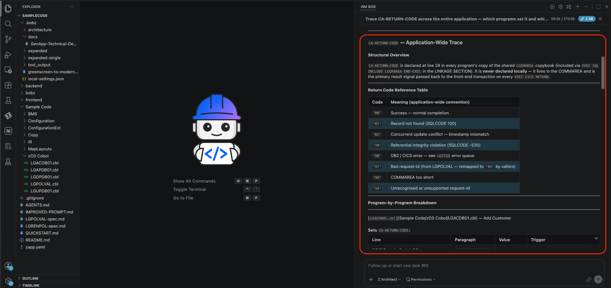

**5. Policy number lifecycle**

```
Show me the data flow for CA-POLICY-NUM from the moment it is assigned in INSERT-POLICY through every paragraph that uses it.
```

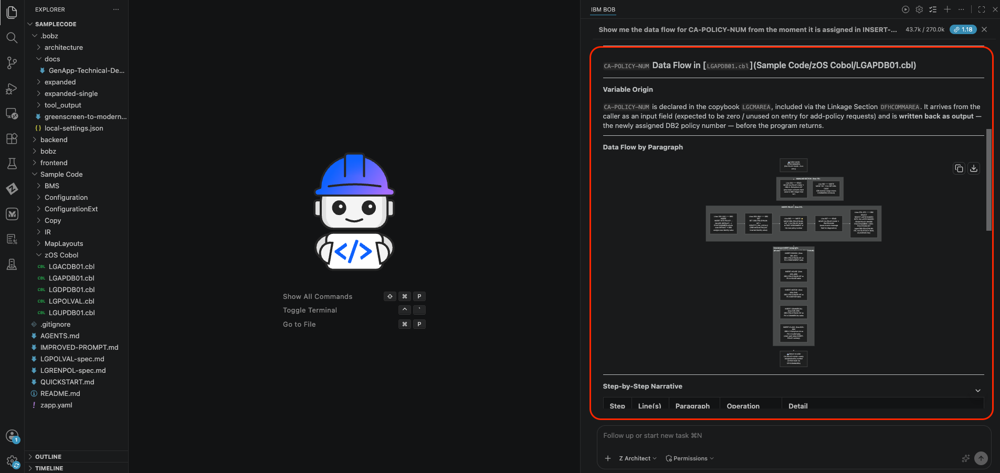

---

## Key Takeaways

- **Z Architect mode** is the right mode for all analysis, graphing, and exploration prompts — it has access to the workspace metadata database built during setup
- **Reverse graphs** (who calls X? who includes Y?) are just as useful as forward graphs when tracing impact
- **Variable flow** prompts are particularly powerful for understanding COMMAREA fields shared across programs
- Every prompt here is a starting point — modify the program names, field names, or scope to explore any part of the application that interests you

---
